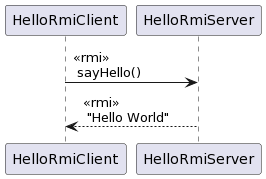

# RPC Case study: Java RMI - Overzicht en concrete code

*[Bart van der Wal, HAN](mailto:bart.vanderwal@han.nl)*, maart 2023

Heb je wellicht net wat theorie gehad over RPC - *Remote Procedure call(? Lees anders even aandachtig de prima pagina op Wikipedia hierover (Wikipedia, z.d.), in ieder geval de definitie hier:

> "In distributed computing, a *remote procedure call* (RPC) is when a computer program causes a procedure (subroutine) to execute in a different address space (commonly on another computer on a shared network), which is coded as if it were a normal (local) procedure call, without the programmer explicitly coding the details for the remote interaction. That is, the programmer writes essentially the same code whether the subroutine is local to the executing program, or remote."

Het RPC concept bestaat al sinds 1960, maar het is wellicht fijn om het wat concreter te maken hoe je als developer hier mee aan de slag kunt, met een voorbeeld in Java.


Als developer ken je vast Java, wat dalend van oude nummer 1 positie, maar nog steeds een van de meest gebruikte Object Oriented (OO) talen, momenteel 3e qua populariteit/aantal google zoekacties (TIOBE, 2023).

Als HAN ICT student in *development* profiel heb je als goed is al wel multithreading gehad in Java, wat een alternatief is voor RPC om meerdere dingen tegelijk te doen (parallelisme). Als je werk verdeelt moet je dit echter vaak aan het einde weer oprapen, oftewel concurrency control. Voor een voorbeeld van Java Multithreading zie bijvoorbeeld mijn 'Hello World' implementatie van een 'parallele fizzbuzz' in een oefentoets voor het 2e jaar ([van der Wal, 2023](https://github.com/bartvanderwal/dea-oefentoets-code2)).

## Remote Method invocation

De Java implementatie van RPC heet **RMI**: *Remote Method Invocation*:

- Op zich wel toepasselijk aangezien 'procedures' in OO land '**method**es' heten (iemand op StackExchange, 2010).
- '**invocation**' kun je zien als een direct synoniem van 'call' (of een 'incantation', zie figuur 1).
- De term '**remote**' ken je ongetwijfeld, zeker na het 'remote werken' van Corona pandemie de afgelopen jaren.


<br clear="all"/>

*Figuur 1*: Dumbledore doet een 'invocatie' over afstand (Quora, 2018)

Bijvoorbeeld in Java 

ChatGPT veroorzaakte begin dit jaar een kleine revolutie, na al eerder GitHub copilot, en wellicht moeten we ons maar vast als 'Prompt Engineer' opstellen, dus laten we het ChatGPT vragen.

>How does java rmi work? Can you show a code example?

>"Java RMI (Remote Method Invocation) is a mechanism that allows a Java object running in one JVM to invoke methods on a remote Java object running in another JVM. RMI is a way to achieve distributed computing in Java."

Bron: [ChatGPT, 7-3-2023](https://chat.openai.com/chat/5561904f-333e-4cac-8a5a-43e7820f2c5e)

1. First, we need to create an interface that defines the methods we want to invoke remotely. Let's call this interface `HelloRmiInterface`. This interface extends the `Remote` interface, indicating that its methods can be invoked remotely.
2. Next, we need to create a class that implements this interface. Let's call this class `HelloRmiServer`. This class extends the UnicastRemoteObject class, which provides a default implementation of the Remote interface. It also implements the HelloInterface and provides an implementation of the "sayHello" method.
3. Finally, we need to create a client program that can invoke the remote method. Let's call this class `HelloRmiClient`. This class locates the RMI registry on the local machine and looks up the "HelloRmiInterface" object. It then casts this object to the HelloInterface and invokes the "sayHello" method.

Zie ook: [Oracle RMI technotes tutorial](https://docs.oracle.com/javase/8/docs/technotes/guides/rmi/hello/hello-world.html)

Vervolgens kwam ChatGPT ook met compilerende code/classes. Maar om RMI ook geheel werkend, en runnend te krijgen moest hier nog wel wat handmatig aan gebeuren, zoals je als beginnend Prompt engineer hopelijk al hebt ervaren. Om overigens nog maar te zwijgen van het *valideren* dat de code ook daadwerkelijk doet wat je wil, maar misschien niet goed uitdrukte of ChatGPT toch net niet goed gepretraind is om te genereren. Maar validatie is voor dit laatste is voor dit 'hello world' voorbeeldje nog niet zo'n issue, en unit tests en TDD aanpak die je als Software Engineer (in training) hopelijk gebruikt mocht ik voor dit explorerende prototype even achterwege gelaten.

Je ziet dus dat RMI ook volgens een client-server model werkt, en dat de communicatie tussen de beide via een methode verloopt, waarvoor je een interface moet definieren. Concreet miste in de ChatGPT code en instructies een main methode in de client, maar. In het echt moeten zowel client als server een main hebben, aangezien het gaat om twee runnende processen.

~~To run this example, you need to compile and run the server program first, using the `rmic` command to generate stub and skeleton files:~~
Compileren is niet meer nodig.

## RMI: Eenweg communicatie

Zie *.puml bestanden in de `plaatjes` folder voor bronbestanden van UML diagrammen.
Deze zijn gemaakt met plantUML documentatie (PlantUML, z.d.).

### Ontwarren 
Onderstaand UML


## How to run (Development environment)

Voor tonen sequence diagram in VS Code run [plantuml  server in docker container](https://hub.docker.com/r/plantuml/plantuml-server) lokaal op *poort* `8081` met dit commando

```bash
docker run -d -p 8081:8080 plantuml/plantuml-server:tomcat
```

```bash
rmiregistry # port 1099 default
javac -d target *.java
java -cp target HelloRmiServer
java -cp target HelloRmiClient
```

Om rmiregistry handmatig te stoppen:

```bash
lsof -i :1099
kill <returnedPid>
```

## Bronnen

- Wikipedia, 2022, *Remote Procedure Call.* Geraadpleegd op <https://en.wikipedia.org/wiki/Remote_procedure_call>
- Salvia, C., Reinhardt, D. 2010 *Method vs Function vs Procedure.* Geraadpleegd op <https://softwareengineering.stackexchange.com/questions/20909/method-vs-function-vs-procedure>
- Oracle technotes, 2018. *Getting Started Using Java RMI*, Geraadpleegd op <https://docs.oracle.com/javase/8/docs/technotes/guides/rmi/hello/hello-world.html>
- Quora, 2018, *... Dumbledore ... incantations.* (a.k.a. invocation), Gevonden op <https://www.quora.com/Hogwart-students-are-taught-wordless-magic-in-the-6th-year-so-why-does-Dumbledore-still-cast-spells-with-incantations>
- Tiobe, 2023. Geraadpleegd op 8-3-2023 op <https://www.tiobe.com/tiobe-index/>
- PlantUML (z.d.) *Sequence Diagram.* PlantUML, geraadpleegd op <https://plantuml.com/sequence-diagram>

*Deze bronnen zijn begin maart 2023 geraadpleegd, tenzij het er anders bij staat, maar anders vermelden we datum niet, zoals APA eigenlijk vereist.