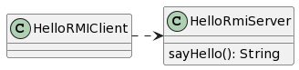
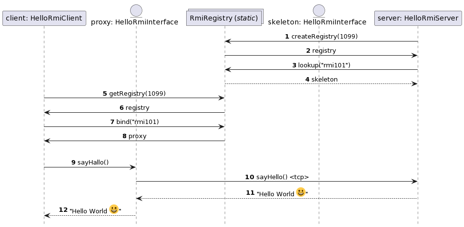

# RPC & Java RMI - Overzicht en concrete code

Welkom in deze repository, met code en een achtergrond artikel over **RMI**: *Remote Method Invocation* in Java. Dit is een implementatie van het concept **RPC**: *Remote Procedure Call*.

Maar zoals hoort in een README nu eerst een 'how to run'. Het artikel/theorie staat verder naar beneden.

## How to run (Development environment)

Download als zip, of clone deze repository. Of run in GitHub als GitHub code spaces.
Run onderstaande commando's in de terminal.
Uitleg staat hierbij. Evt. te refactoren naar startup script, en/of in een Java enabled Docker container.

### Terminal

De gecompileerde classes gaan naar `target` folder, alvast de Mavan standaard.

Voor projecten met meer dan een file, en geneste structuur/packages moet je `-sourcepath` parameter gebruiken.
Anders krijg je veel 'cannot find symbol` errors.
Bron: https://stackoverflow.com/questions/13407983/javac-cannot-find-symbol-error-with-command-line

```bash
# Starten/aanmaken RMR registry op host computer (vereist voor werken RMI)
# Deprecated: De server programma maakt nu de 'RMI Registry' aan.
# rmiregistry # port 1099 default

# Genereren stubs en skeletons voor gebruik client en server voor onderlinge communicatie
# Deprecated: De stubs en skeleton worden op runtime dynamisch gegenereerd wanneer nodig,
# Maar toch vermeldenswaardig vanwege parallel voor noodzaak generatie/interface definitie in alternatieven van RMI
# Zoals moderne gRPC (native), standaard REST API (Swagger, 3rd party) of old skool SOAP (wsdl e.d.)
# rmic -classpath HelloRmiInterface

# Compileer de code voor de Server app.
javac -d target -sourcepath src src/chatjava/ChatServerApp.java

# Compileer de code voor de Client app.
javac -d target -sourcepath src src/chatjava/ChatClientApp.java

# Run eerst de server (1e proces met eigen JVM).
java -cp target chatjava/ChatServerApp

# Run dan de client (2e proces met ook eigen JVM)
# Omdat server nog draait, moet je 2e prompt openen, bv. 2e 'tabblad'.
java -cp target chatjava/ChatClientApp
```

### Stoppen rmiregistry handmatig

Om de rmiregistry handmatig te stoppen, kun je het volgende doen.

```bash
lsof -i :1099
kill <returnedPid>
```

### Genereren plantuml diagrammen

Voor het tonen/genereren van de PlantUml diagrammen in VS Code run [plantuml  server in docker container](https://hub.docker.com/r/plantuml/plantuml-server) lokaal op *poort* `8081` met dit commando:

```bash
docker run -d -p 8081:8080 plantuml/plantuml-server:tomcat
```

## RPC Case study: Java RMI - Achtergrond artikel


    <!-- <br clear="all"/> -->
    <!-- <figcaption><em>Figuur 1</em>: Dumbledore doet een<br/>'invocatie' op afstand (Quora, 2018)</figcaption> -->

*Naar aanleiding van een gepland gastcolle in maart 2023 bij de course SWA in het semester Advanced Software Development, ter promotie van de [minor DevOps](https://minor-devops.ams3.digitaloceanspaces.com/index.html), die start in september 2023 aan de HAN.*

*[Bart van der Wal, HAN](mailto:bart.vanderwal@han.nl)*, maart 2023

Heb je wellicht net wat theorie gehad over RPC - *Remote Procedure call*? Lees anders even aandachtig de [prima pagina op Wikipedia](https://en.wikipedia.org/wiki/Remote_procedure_call) over RPC (Wikipedia, z.d.). Lees in ieder geval deze definitie:

> "In distributed computing, a *remote procedure call* (RPC) is when a computer program causes a *procedure* (subroutine) to execute in a *different address space* (commonly on another computer on a shared network), which is coded *as if* it were a normal (local) procedure call, without the programmer explicitly coding the details for the remote interaction. That is, the programmer writes essentially the same code whether the subroutine is local to the executing program, or remote."

Het RPC concept bestaat al sinds 1960, schrijft dezelfde pagina, maar het is wellicht fijn om het wat concreter te maken hoe je als developer hier mee aan de slag kunt, met een voorbeeld in Java.


Als developer ken je vast Java, ooit dé populairste Object Oriented (OO) taal, en momenteel nog 3e qua populariteit/aantal google zoekacties (TIOBE, 2023, van 20+ naar ca 13% gebruik in 20 jaar).

Als HAN ICT student in *development* profiel heb je ook het concept *multithreading* gehad in Java, wat een alternatief is voor RPC om meerdere dingen tegelijk te doen (parallelisme). Als je werk verdeelt moet je de resultaten vaak aan het einde weer oprapen: synchroniseren, zowel in tijd als de dat (*concurrency control*). Voor een voorbeeld van Java Multithreading zie bijvoorbeeld mijn 'Hello World' implementatie van een 'parallele fizzbuzz' in [deze repo (van der Wal, 2023](https://github.com/bartvanderwal/dea-oefentoets-code2)).

Bij RPC gaat parallelisme over meerdere *processen* i.p.v. *meerdere threads*. Dit zijn OS processen. Dus bij RPC aanpak 'geef je meer uit handen' aan het OS. Maar het OS kan dit beter optimaliseren qua load op het systeem. Omdat het OS dichter bij de hardware zit dan jouw software.

Volgens de 8e van de [12factor regel 'Concurrency'](https://12factor.net/concurrency) heeft deze aanpak de voorkeur. Dit principe is: "Scale out via the process model". Dit geldt in ieder geval voor SAAS applicaties, binnen de moderne 'Cloud native' aanpak. Okee, dus bevat old-skool Java (introductie in 1995) met java RMI wat er al vroegtijdig inzat (ik vind [artikel uit 2000](https://www.infoworld.com/article/2076234/get-smart-with-proxies-and-rmi.html)) op infoworld.com, dan zo'n modern krachtig mechanisme uit het nieuwe cloud tijdperk? Het korte antwoord is: Ja, en nee. Meer volgt, we moeten wel wat met de `stubs` en `skeletons` die RMI gebruikt; zie onderstaande figuur Maar we moeten nu eerst meer richting code!


Bron: [Wikipedia, z.d.](https://en.wikipedia.org/wiki/Java_remote_method_invocation) meer op pagina over ['Distributed object communication'](https://en.wikipedia.org/wiki/Distributed_object_communication#Skeleton)

## Yet another Java API? - RMI: Remote Method invocation

De Java implementatie van RPC heet **RMI**: *Remote Method Invocation*:

- Op zich wel toepasselijk aangezien 'procedures' in OO land '**method**es' heten (iemand op StackExchange, 2010).
- '**invocation**' kun je zien als een direct synoniem van 'call' (of een 'incantation', zie figuur 1).
- De term '**remote**' ken je ongetwijfeld, zeker na het 'remote werken' van Corona pandemie de afgelopen jaren.

Hier een sequence diagram die een Java klasse toont (de client) die een methode van een andere klasse aanroept (de server).
Het is een simpele 'Hello, World' applicatie, maar aan de klassenamen kun je zien dat de methode aanroep 'remote' moet; dus over het netwerk. De klassen zitten in twee Java Programma's (dus 2 processen/2 JVM's). Hierbij zou het ook kunnen dat het 2e programma op een hele andere fysieke machine draait. In de demo/code is dit niet geconfigureerd, maar dit doet op zich niks af aan kracht, want de aanroep over het netwerk (loopback adres, e.g. via `localhost`).


## Prompt engineering om RMI op Code niveau te begrijpen

Maar we wilden naar code toe. ChatGPT veroorzaakte begin dit jaar een kleine revolutie, na al eerder GitHub copilot. Wellicht moeten we ons maar vast als 'Prompt Engineer' opstellen, dus laten we ChatGPT eens om hulp vragen.

>How does java rmi work? Can you show a code example?

Reactie:
>"Java RMI (Remote Method Invocation) is a mechanism that allows a Java object running in one JVM to invoke methods on a remote Java object running in another JVM. RMI is a way to achieve distributed computing in Java."

1. First, we need to create an interface that defines the methods we want to invoke remotely. Let's call this interface `HelloRmiInterface`. This interface extends the `Remote` interface, indicating that its methods can be invoked remotely.
2. Next, we need to create a class that implements this interface. Let's call this class `HelloRmiServer`. This class extends the UnicastRemoteObject class, which provides a default implementation of the Remote interface. It also implements the HelloInterface and provides an implementation of the "sayHello" method.
3. Finally, we need to create a client program that can invoke the remote method. Let's call this class `HelloRmiClient`. This class locates the RMI registry on the local machine and looks up the "HelloRmiInterface" object. It then casts this object to the HelloInterface and invokes the "sayHello" method.

Bron: [ChatGPT, 7-3-2023](https://chat.openai.com/chat/5561904f-333e-4cac-8a5a-43e7820f2c5e) (deeplink alleen voor auteur toegankelijk (hopelijk ;))

Vervolgens kwam ChatGPT ook met compilerende code/classes. Maar om RMI ook geheel werkend, en runnend te krijgen moest hier nog wel wat handmatig aan gebeuren, om tot de werkende code in de respo te komen. Als beginnend *prompt engineer* heb je het mogelijk zelf al ervaren. ChatGPT vindt soms sneller code in zijn database/model, dan wij op internet, en kan het gericht op jou vraag reworden. Het geeft veelal ook wel gemaakte fouten toe, en wil ook wel at aanpassen als je slim vraagt/kritisch opmerkt. Maar er blijft werk voor ons Software Engineers. Zelfs als ChatGPT nog verder verbeterd, en bijvoorbeeld ook netjes bronvermelding gaat/kan doen, zoals wettelijk verplicht, maar blijft er nog altijd handmatig (denk)werk. Namelijk om code output reacties te *valideren*. En evt. te integreren met andere/bestaande delen. Omdat ChatGPT soms consequent dingen fout doet, hoe hard deze ook beweert aan je vraag te voldoen, moet je altijd controleren dat de code ook daadwerkelijk doet wat jij - of je opdrachtgever wil. Een aanpak waarbij ook veel waarde zit in geautomatiseerde tests. Maar daarvoor is dit 'hello world' voorbeeldje geen goed voorbeld. Dus unit tests en een TDD aanpak die je als Software Engineer (in training) essentieel zijn, zijn voor dit explorerende prototype even achterwege gelaten. Want het is allemaal 'gluecode', en geen domeinlogica.

## Foutjes van ChatGPT

Op hoofdlijnen vond ik twee fouten van ChatGPT:

- De client miste een `main` en was daardoor niet uitvoerbaar als onafhankelijk proces.
- ChatGPT gaf naast compilatie en runstappen voor 'client' en 'server' class met `javac` en `java`, aan om RMI CLI programma `rmic` te runnen op de 'interface'.

Met deze stap genereerde je in een ver verleden statische bestanden voor de stub en skeleton. Maar bij runnen gaf deze `rmic` zelf echter aan dat deze deprecated was. Ik draai Java 17, maar dit is al zo sinds Java 5. Al heel wat jaartjes terug. De missende `main` fixte ik op basis van 2e bron, minder handig dan ChatGPT, maar meer auhoritatieve bron, namelijk officiele Oracle documentatie over RMI: [Oracle RMI technotes tutorial](https://docs.oracle.com/javase/8/docs/technotes/guides/rmi/hello/hello-world.html). Ook gebruikte ik hiervan uiteindelijk code, en nicifiede nog wat om bijvoorbeeld excepties wat specifieker af te vangen, dan `} catch Exception e` zoals de best practice is. Ook hernoemde ik enkele variabelen en alle klassenamen. Bijvoorbeeld `HalloClient.java` noemde ik `HalloRmiClient,java` etc. Meeste tijd was ik kwijt met alles correct handmatig compileren en runnen zonder IntelliJ, aangezien ik in deze IDE niet goed weet hoer ik twee samenwerkende Java programma's tegelijk moet runnen. Hier [schijnen wel opties voor te zijn](https://stackoverflow.com/questions/8774024/how-to-open-and-edit-multiple-projects-in-the-same-window), maar gezien de weinige code en functionaliteit ging ik voor basic workflow in Visual Studio code en terminal.

Bestudeer zelf de code in detail in de detail. In de volgende paragraaf bekijken we dit op hoofdlijnen. Maar in de code herken je hopelijk tenminste dat RMI volgens een client-server model werkt. Dat de communicatie tussen de beide via een methode verloopt, waarvoor je een interface moet definieren.

~~To run this example, you need to compile and run the server program first, using the `rmic` command to generate stub and skeleton files:~~
Compileren is niet meer nodig.

Zie `*.puml` bestanden in de `plaatjes` folder voor bronbestanden van UML diagrammen.
Deze zijn gemaakt met plantUML documentatie (PlantUML, z.d.).

### Hoe werkt het nou? 😀

Bovenin het artikel zag je al een kort diagram, met grote `Network` in het midden en `client` en `server` links en rechts, en ook twee wellicht minder bekende term `stub` en `skeleton`. Binnen OO gebruiken we voor wat meer detail over volgorde, zonder direct al het detail van de code wel eens... een UML sequence diagram.

#### Simpel: Call alsof lokaal is


Dit diagram brengt het terug tot een enkele call, net alsof het een lokale call is. Dit was precies het idee van RPC. Weet je nog uit de Wikipedia definitie: "the programmer writes essentially the same code whether the subroutine is local to the executing program, or remote".

Zoveel simpelheid is aanleiding om een smiley toe te voegen in het standaard "Hello, World!" bericht. En zelfs PlantUML ondersteunt dit. Het probleem is echter dat in de code GEEN directe relatie is. Wel een indirecte. Volgende sectie legt dit uit. Het artikel eindigt met een meer gedetailleerd klassendiagram, die het core idee van RPC (een 'remote call' echter meer obfusceert dan duidelijk maakt.



#### Middle man: remote call alsof deze lokaal is

In de code zie je echter toch wel een heel ander verhaal met de nodige boiler plate code van classes, inheritance en implements ('realization' in UML/Astah) en andere OO constructen. En dan ontbreken in het diagram ook termen 'stub' en 'skeleton' die nog niet uitgelegd zijn. De enige hint hierover in UML diagram is de <<stereotype>> `<<rmi>>` op de pijlen.

En de `HelloRmiInterface` die in de code zit

Het volgende sequence diagram is een lichte uitbreiding hiervan, waarbij de <<rmi>> steroetype is uitgewerkt ieder geval met een 'stub' als middelman tussen client en server.

Figuur: Sequence Diagram van Java RMI

Tot slot het meeste detail in dit laatste sequence diagram .

Figuur: Uitgebreid sequence Diagram van Java RMI

## RPC: Een leaky abstraction?

Ook wil ik waarschuwen voor de 'leaky abstraction' van RPC. Die eigenlijk een logisch gevolg is van het concept dat RPC is. Namelijk het idee 'dat het niet uitmaakt' of 'niet uit moet maken' je een methode of procedure lokaal aanroept of verderop. Qua developen zag je al dat er toch de nodige constructies en boiler plate code komt kijken, alsmede extra tools als de rmiregistry, en evt. code generatie van de `rmic` om een simpele hello world te doen'. Maar ook qua performance moet je wel degelijk nadenken.

Martin Fowler heeft hier veel beter over nagedacht en geschreven dan ik zelf, dus ik verwijs graag naar zijn artikel ['Microservices and the First Law of Distributed Objects'](https://martinfowler.com/articles/distributed-objects-microservices.html
). Het artikel is uit 2014 al weer en de 'law' zelf schreef/bedacht hij al in zijn veel 1006 boek 'Patterns of Enterprise Application Development' die als verplicht studiemateriaal binnen HAN ICT geldt (bij course OOSE DEA, optioneel materiaal SWA). Toch is het wellicht verloren gegaan. Dus kort: De 'First law of distributed objects is: 'Don't distribute your objects'.

Ja, laat even inzinken. Dit lijkt een beetje op 'die mop over de Titanic'... (die kwam niet, ([Trouw, 1998[(https://www.trouw.nl/nieuws/ken-je-die-mop-van-de-titanic-die-kwam-niet~b38d38c4/)]) schoorsteenvege.

Wat Fowler probeert aan te geven is dat je moet nadenken over kosten van transport van veel data over netwerk over langere afstand. En dat je het distribueren dus in de eerste plaats NIET moet.


Figuur: Uitgebreid sequence Diagram van Java RMI

## Volledig klassendiagram: toch liever overzichtelijk dan volledig

Tot slot hierbij nog een vollediger klassendiagramm van de code, om de statische onderdelen duidelijk te maken. De relatie tussen client en server die het eerdere simpele klassediagram nog illustreerde, maar in de code alleen indirect aanwezig is, is hier ook niet weergegeven.

Als je dit klassendiagram rustig bekijkt maakt dit wellicht wat relaties tussen aanwezige klassen duidelijk. Tegelijkertijd is het een heel complex diagram voor zo'n simpel stukje functionaliteit. En illustreert het diagram vooral dat het in een klassendiagrammen beter is om kort, duidelijk en overzichtelijk te zijn, dan te proberen volledig te zijn. De simpele conceptuele relatie die er tussen client en server is, maar in de code niet direct, blijkt beter uit het simpele diagram. De nuancering hierop kun je dan beter in een toelichting vermelden. Dat is in dit artikel vooral via de sequence diagrammen die beter het gedrag in tijd weergeven.

Einstein: "Make everything as simple as possible. But not simpler."


## Next steps

Deze code gaf je hopelijk een indicatie van wat RPC is en hoe dit toe te passen. De volgende stap is al snel naar tweeweg communicatie.

Voor het beter begrijpen van RPC, Naast concrete implementatie in Java, en vergelijken RPC vs. multithreading, kun je RPC ook beter begrijpen door het te vergelijken met REST API die je waarschijnlijk al beter kent. En ook veel populairder is. Een voordeel verschil is wel dat REST API's vaak via HTTP praten, en RMI bijvoorbeeld al op TCP niveau werkt, dus laagje lager, dus performanter.

Een andere vergelijking en implementatie die je kunt bekijken is moderne RPC implementatie van Google, namelijk gRPC. Hoewel ze zelf beweren dat de `g` hierin NIET voor Google staat (maar zeggen ook niet waar dan wel voor). Hiervoor verwijs ik graag naar het code en het artikel van mijn oud minor student Daniel van de Ruit hierover. Hier als idee het schema van een Polyglot Microsevice architectuur met een .NET5 applicatie en een Kotlin applicatie.

## Bronnen

- Wikipedia, 2022, *Remote Procedure Call.* Geraadpleegd op <https://en.wikipedia.org/wiki/Remote_procedure_call>
- Wikipedia, z.d. Geraadpleegd op <https://en.wikipedia.org/wiki/Java_remote_method_invocation>
- Wikipedia, z.d. Geraadpleegd op <https://en.wikipedia.org/wiki/Java_remote_method_invocation>
- Salvia, C., Reinhardt, D. 2010 *Method vs Function vs Procedure.* Geraadpleegd op <https://softwareengineering.stackexchange.com/questions/20909/method-vs-function-vs-procedure>
- Oracle technotes, 2018. *Getting Started Using Java RMI*, Geraadpleegd op <https://docs.oracle.com/javase/8/docs/technotes/guides/rmi/hello/hello-world.html>
- Quora, 2018, *... Dumbledore ... incantations.* (a.k.a. invocation), Gevonden op <https://www.quora.com/Hogwart-students-are-taught-wordless-magic-in-the-6th-year-so-why-does-Dumbledore-still-cast-spells-with-incantations>
- Tiobe, 2023. Geraadpleegd op 8-3-2023 op <https://www.tiobe.com/tiobe-index/>
- PlantUML (z.d.) *Sequence Diagram.* PlantUML, geraadpleegd op <https://plantuml.com/sequence-diagram>

*Deze bronnen zijn begin maart 2023 geraadpleegd, tenzij het er anders bij staat, maar anders vermelden we datum niet, zoals APA eigenlijk vereist.

