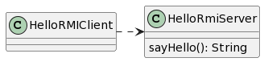
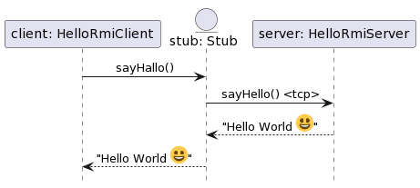
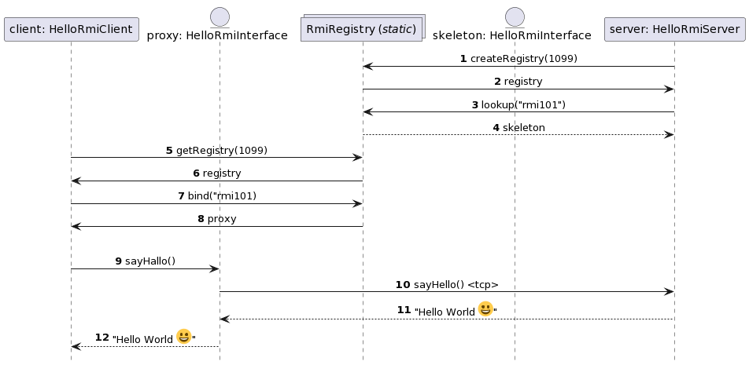
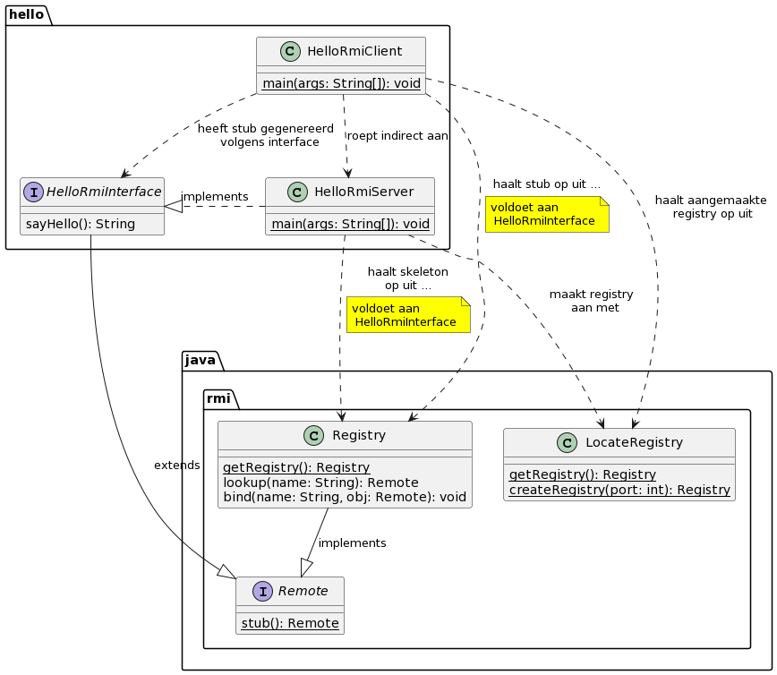

## RPC Case study: Java RMI - Magie op afstand?

    <!--   -->
    <!-- <figcaption><em>Figuur 1</em>: Dumbledore doet een 'invocatie' op afstand (Quora, 2018)</figcaption> -->

*Deze blog schreef naar aanleiding van, en als ondersteuning bij wat toegepast onderzoek naar RPC dat ik deed voor een geplande gastles in maart 2023 bij de course SWA in het semester Advanced Software Development (ASD). Deze les geef ik als promotie van de [minor DevOps](https://minor-devops.ams3.digitaloceanspaces.com/index.html), die start in september 2023 aan de HAN. Wellicht kan dit artikel, en de voorbeeld code in deze repository, jou ook helpen om RPC en/of JAVA RMI te gebruiken of beter te begrijpen.*

*[Bart van der Wal, HAN](mailto:bart.vanderwal@han.nl)*, maart 2023

"Any sufficiently advanced technology is indistinguishable from magic."
— Arthur C. Clarke ([z.d.](https://en.wikipedia.org/wiki/Clarke%27s_three_laws))

Heb je wellicht net wat theorie gehad over RPC - *Remote Procedure call*? Lees anders even aandachtig de [prima pagina op Wikipedia](https://en.wikipedia.org/wiki/Remote_procedure_call) over RPC (Wikipedia, z.d.). Lees in ieder geval deze definitie:

> "In distributed computing, a *remote procedure call* (RPC) is when a computer program causes a *procedure* (subroutine) to execute in a *different address space* (commonly on another computer on a shared network), which is coded *as if* it were a normal (local) procedure call, without the programmer explicitly coding the details for the remote interaction. That is, the programmer writes essentially the same code whether the subroutine is local to the executing program, or remote."

Het nut van RPC is dus om 'functionaliteit' van 'elders' in je eigen systeem te kunnen gebruiken, alsof het lokaal aanwezig is. Het concept *RPC* bestaat al sinds 1960, schrijft dezelfde pagina. Doel van deze blog s wellicht fijn om het wat concreter te maken hoe je als developer hier mee aan de slag kunt, met een voorbeeld in Java.

Als developer ken je vast Java, ooit dé populairste Object Oriented (OO) taal, en momenteel nog 3e qua populariteit/aantal google zoekacties (TIOBE, 2023, van 20+ naar ca 13% gebruik in 20 jaar).

>Me: "Write a joke about RPC"

> ChatGPT: "Sure, here's a joke about RPC: 

>"Why did the programmer refuse to use RPC for communication? ... Because they didn't want to risk a race condition with a snail!"

Als HAN ICT student in *development* profiel heb je ook het concept *multithreading* gehad in Java, wat een alternatief is voor RPC om meerdere dingen tegelijk te doen (parallelisme). Als je werk verdeelt moet je de resultaten vaak aan het einde weer oprapen: synchroniseren, zowel in tijd als de dat (*concurrency control*). Voor een voorbeeld van Java Multithreading zie bijvoorbeeld mijn 'Hello World' implementatie van een 'parallele fizzbuzz' in [deze repo (van der Wal, 2023](https://github.com/bartvanderwal/dea-oefentoets-code2)).

Bij RPC gaat parallelisme over meerdere *processen* i.p.v. *meerdere threads*. Dit zijn OS processen. Dus bij RPC aanpak 'geef je meer uit handen' aan het OS. Maar het OS kan dit beter optimaliseren qua load op het systeem. Omdat het OS dichter bij de hardware zit dan jouw software. Het 'remote' stukje in RPC maakt het echter ook wel weer uitgebreider dan alleen maar 'processen op dezelfde computer' (wat wel IPC - [Inter Proces Communication](https://stackoverflow.com/questions/51452/best-practice-for-java-ipc) heet. Op IPC gaat dit artikel niet in, maar kijk bijvoorbeeld deze stackoverflow vraag voor een idee. Bij RPC moete processen ook op verschillende computers op een netwerk kunnen draaien, of zelfs op verchillende netwerken via het internet. 

Volgens de 8e van de [12factor regel 'Concurrency'](https://12factor.net/concurrency) heeft de aanpak met aparte processen de voorkeur boven gebruik van Threads. Dit principe is kortgezegd: "Scale out via the process model". Deze 12factors zijn geschreven voor SAAS applicaties, binnen de moderne 'Cloud native' aanpak. Maar 'old-skool' Java (introductie in 1995) ondersteunt via Java RMI (wat er in ieder geval al sinds [2000](https://www.infoworld.com/article/2076234/get-smart-with-proxies-and-rmi.html)) dus al dit moderne principe uit het nieuwe cloud tijdperk. Er zijn ook modernere varianten, die we aan het eind behandelen. Maar we moeten nu eerst meer richting code! Kijk eerst nog even kort het algemene diagram van RMI in onderstaande figuur van Wikipedia.

*Figuur 1*: Overzicht van Java RMI: netwerk communicatie met *stub* voor client en *skeleton* aan server kant ([Wikipedia, z.d., RMI](https://en.wikipedia.org/wiki/Java_remote_method_invocation) en ['Distributed object communication'](https://en.wikipedia.org/wiki/Distributed_object_communication#Skeleton)

Merk op dat er tussen 'client' en 'server' nog wat magie zit met termen `stubs` en `skeletons`. Dit is de abstractie om 'remoting' mogelijk te maken:
- Een *stub* noem ik liever een *proxy*, er is wel degelijk functionaliteit, anders dan bij *stub* in unit testen.
- Een *skeleton* is een oudere term uit programmeren, namelijk een opzet van code als pseudocode. Of enkel de methode header om te laten compileren, maar body met nog uit te werken code comments. Dus een skelet, waar nog vlees aan moet komen. Dit was veelal in een tijd voordat er (expliciete) interfaces en/of (OO) programmeertalen waren.

Een stub focust op datastructuur parameters en return waarde, ofwel **hoe** methode aan te roepen. Een skeleton focust op functionaliteit: **wat** doet de methode.

## Yet another Java API? - RMI: Remote Method invocation

De Java implementatie van RPC heet **RMI**: *Remote Method Invocation*:

- Op zich wel toepasselijk aangezien 'procedures' in OO land '**method**es' heten (iemand op StackExchange, 2010).
- '**invocation**' kun je zien als een direct synoniem van 'call' (of een 'incantation', zie figuur 1).
- De term '**remote**' ken je ongetwijfeld, zeker na het 'remote werken' van Corona pandemie de afgelopen jaren.

Hier een sequence diagram die een Java klasse toont (de client) die een methode van een andere klasse aanroept (de server).
Het is een simpele 'Hello, World' applicatie, maar aan de klassenamen kun je zien dat de methode aanroep 'remote' moet; dus over het netwerk. De klassen zitten in twee Java Programma's (dus 2 processen/2 JVM's). Hierbij zou het ook kunnen dat het 2e programma op een hele andere fysieke machine draait. In de demo/code is dit niet geconfigureerd, maar dit doet op zich niks af aan kracht, want de aanroep over het netwerk (loopback adres, e.g. via `localhost`).

*Figuur 2*: Simpel sequence diagram van Java RMI

## Prompt engineering om RMI op Code niveau te begrijpen

We willen naar code toe. ChatGPT veroorzaakte begin dit jaar een kleine revolutie, na al eerder GitHub copilot. Wellicht moeten we ons maar vast als 'Prompt Engineer' opstellen, dus laten we ChatGPT eens om hulp vragen.

>How does java rmi work? Can you show a code example?

Reactie:
>"Java RMI (Remote Method Invocation) is a mechanism that allows a Java object running in one JVM to invoke methods on a remote Java object running in another JVM. RMI is a way to achieve distributed computing in Java."

1. First, we need to create an interface that defines the methods we want to invoke remotely. Let's call this interface `HelloRmiInterface`. This interface extends the `Remote` interface, indicating that its methods can be invoked remotely.
2. Next, we need to create a class that implements this interface. Let's call this class `HelloRmiServer`. This class extends the UnicastRemoteObject class, which provides a default implementation of the Remote interface. It also implements the HelloInterface and provides an implementation of the "sayHello" method.
3. Finally, we need to create a client program that can invoke the remote method. Let's call this class `HelloRmiClient`. This class locates the RMI registry on the local machine and looks up the "HelloRmiInterface" object. It then casts this object to the HelloInterface and invokes the "sayHello" method.

Bron: [ChatGPT, 7-3-2023](https://chat.openai.com/chat/5561904f-333e-4cac-8a5a-43e7820f2c5e) (deeplink alleen voor auteur toegankelijk (hopelijk ;))

Vervolgens kwam ChatGPT ook met compilerende code/classes. Maar om RMI ook geheel werkend, en runnend te krijgen moest hier nog wel wat handmatig aan gebeuren, om tot de werkende code in de respo te komen. Als beginnend *prompt engineer* heb je het mogelijk zelf al ervaren. ChatGPT vindt soms sneller code in zijn database/model, dan wij op internet, en kan het gericht op jou vraag reworden. Het geeft veelal ook wel gemaakte fouten toe, en wil ook wel at aanpassen als je slim vraagt/kritisch opmerkt. Maar er blijft werk voor ons Software Engineers. Zelfs als ChatGPT nog verder verbeterd, en bijvoorbeeld ook netjes bronvermelding gaat/kan doen, zoals wettelijk verplicht, maar blijft er nog altijd handmatig (denk)werk. Namelijk om code output reacties te *valideren*. En evt. te integreren met andere/bestaande delen. Omdat ChatGPT soms consequent dingen fout doet, hoe hard deze ook beweert aan je vraag te voldoen, moet je altijd controleren dat de code ook daadwerkelijk doet wat jij - of je opdrachtgever wil. Een aanpak waarbij ook veel waarde zit in geautomatiseerde tests. Maar daarvoor is dit 'hello world' voorbeeldje geen goed voorbeld. Dus unit tests en een TDD aanpak die je als Software Engineer (in training) essentieel zijn, zijn voor dit explorerende prototype even achterwege gelaten. Want het is allemaal 'gluecode', en geen domeinlogica.

## Foutjes van ChatGPT

Op hoofdlijnen vond ik twee fouten van ChatGPT:

- De client miste een `main` en was daardoor niet uitvoerbaar als onafhankelijk proces.
- ChatGPT gaf naast compilatie en runstappen voor 'client' en 'server' class met `javac` en `java`, aan om RMI CLI programma `rmic` te runnen op de 'interface'.

Met deze stap genereerde je in een ver verleden statische bestanden voor de stub en skeleton. Maar bij runnen gaf deze `rmic` zelf echter aan dat deze deprecated was. Ik draai Java 17, maar dit is al zo sinds Java 5. Al heel wat jaartjes terug. De missende `main` fixte ik op basis van 2e bron, minder handig dan ChatGPT, maar meer auhoritatieve bron, namelijk officiele Oracle documentatie over RMI: [Oracle RMI technotes tutorial](https://docs.oracle.com/javase/8/docs/technotes/guides/rmi/hello/hello-world.html). Ook gebruikte ik hiervan uiteindelijk code, en nicifiede nog wat om bijvoorbeeld excepties wat specifieker af te vangen, dan `} catch Exception e` zoals de best practice is. Ook hernoemde ik enkele variabelen en alle klassenamen. Bijvoorbeeld `HalloClient.java` noemde ik `HalloRmiClient,java` etc. Meeste tijd was ik kwijt met alles correct handmatig compileren en runnen zonder IntelliJ, aangezien ik in deze IDE niet goed weet hoer ik twee samenwerkende Java programma's tegelijk moet runnen. Hier [schijnen wel opties voor te zijn](https://stackoverflow.com/questions/8774024/how-to-open-and-edit-multiple-projects-in-the-same-window), maar gezien de weinige code en functionaliteit ging ik voor basic workflow in Visual Studio code en terminal.

Bestudeer zelf de code in detail in de detail. In de volgende paragraaf bekijken we dit op hoofdlijnen. Maar in de code herken je hopelijk tenminste dat RMI volgens een client-server model werkt. Dat de communicatie tussen de beide via een methode verloopt, waarvoor je een interface moet definieren.

~~To run this example, you need to compile and run the server program first, using the `rmic` command to generate stub and skeleton files:~~
Compileren is niet meer nodig.

Zie `*.puml` bestanden in de `plaatjes` folder voor bronbestanden van UML diagrammen.
Deze zijn gemaakt met plantUML documentatie (PlantUML, z.d.).

### Hoe werkt het nou? 😀

Bovenin het artikel zag je al een kort diagram, met grote `Network` in het midden en `client` en `server` links en rechts, en ook twee wellicht minder bekende term `stub` en `skeleton`. Binnen OO gebruiken we voor wat meer detail over volgorde, zonder direct al het detail van de code wel eens... een UML sequence diagram.

#### Simpel: Remote call alsof lokaal is?

*Figuur 3*: Simpel klasse diagram van Java RMI, nogmaals

Dit diagram brengt het terug tot een enkele call, net alsof het een lokale call is. Dit was precies het idee van RPC. Weet je nog uit de Wikipedia definitie: "the programmer writes essentially the same code whether the subroutine is local to the executing program, or remote".

Zoveel simpelheid is aanleiding om een smiley toe te voegen in het standaard "Hello, World!" bericht. En zelfs PlantUML ondersteunt dit. Het probleem is echter dat in de code GEEN directe relatie is. Wel een indirecte. Volgende sectie legt dit uit. Het artikel eindigt met een meer gedetailleerd klassendiagram, die het core idee van RPC (een 'remote call' echter meer obfusceert dan duidelijk maakt.

*Figuur 4*: Simpel klasse diagram van Java RMI

#### Middle man: remote call alsof deze lokaal is

In de code zie je echter toch wel een heel ander verhaal met de nodige boiler plate code van classes, inheritance en implements ('realization' in UML/Astah) en andere OO constructen. En dan ontbreken in het diagram ook termen 'stub' en 'skeleton' die nog niet uitgelegd zijn. De enige hint hierover in UML diagram is de <<stereotype>> `<<rmi>>` op de pijlen.

En de `HelloRmiInterface` die in de code zit

Het volgende sequence diagram is een lichte uitbreiding hiervan, waarbij de <<rmi>> steroetype is uitgewerkt ieder geval met een 'stub' als middelman tussen client en server.

*Figuur 5*: Uitgebreider Sequence Diagram van Java RMI

Tot slot figuur 5 nog uitbreiding van sequence diagram .

*Figuur 6*: Uitgebreid sequence Diagram van Java RMI

## RPC: Leaky abstraction? #performanceLeak

Ook wil ik waarschuwen voor de 'leaky abstraction' van RPC. Dit is eigenlijk een logisch gevolg is van het concept van RPC. Namelijk 'dat het niet uitmaakt' (of 'niet uit zou moeten maken') of je een methode lokaal aanroept of van afstand. Qua developen zag je al dat er toch de nodige constructies en boiler plate code komt kijken, alsmede extra tools als de rmiregistry, en evt. code generatie van de `rmic` om een simpele hello world te doen'. Maar ook qua performance moet je wel degelijk nadenken. Je hebt dus een performance lek in je applicatie, dat je wel degelijk gaat merken, als je zomaar allerlei calls remote gaat doen i.p.v. lokaal omdat ''dit uitkomt' . Kortgezegd kun je dit vergelijken met wat je al in 1e jaar bij WebTech leerde. Je moet geen Database calls moet doen binnen een for loop ('efficiente queries').

*Figuur 7*: Leaking toilet tank ([Bron: Plumbing Southe Florida](https://www.sunshineplumbingofsouthflorida.com/plumbing-south-florida/leaking-toilet-tank/))

Een letterlijke analogie is die van de toilet die na het doortrekken blijft doorlopen. Een toilet is geen ICT systeem, maar ouderwets mechanisch systeem. Maar heeft wel degelijk een abstractie (een facade) van de doortrekknop, -hendel of ouderwets touwtje. Als de toilet echter blijft doorlopen kom je echter dat er intern een heel systeem is, en moet je abstractie misschien even openbreken voor handmatige interventie (bij een toilet werkt aan de buitenkant hard op de spoelbak rammen nog wel eens; dit geeft bij computers minder succes).

Martin Fowler heeft hier veel beter over nagedacht en geschreven dan ik zelf. Ik verwijs graag naar zijn artikel ['Microservices and the First Law of Distributed Objects'](https://martinfowler.com/articles/distributed-objects-microservices.html
). Het artikel is uit 2014 al weer en de 'law' zelf schreef/bedacht hij al in zijn veel 1006 boek 'Patterns of Enterprise Application Development' die als verplicht studiemateriaal binnen HAN ICT geldt (bij course OOSE DEA, optioneel materiaal SWA). Toch is het wellicht verloren gegaan. Dus kort: De 'First law of distributed objects is: 'Don't distribute your objects'.

Ja, laat even inzinken. Dit lijkt een beetje op 'die mop over de Titanic'... (die kwam niet, ([Trouw, 1998[(https://www.trouw.nl/nieuws/ken-je-die-mop-van-de-titanic-die-kwam-niet~b38d38c4/)]).

Wat Fowler probeert aan te geven is dat je moet nadenken over kosten van transport van veel data over netwerk over langere afstand. En dat je het distribueren waar mogelijk niet moet doen. En als je het doet, moet je veel data in één keer oversturen (coarse grained) en de detailprocessing intern op de client of server doen (fine grained).

## Volledig klassendiagram: toch liever overzichtelijk dan volledig

Tot slot hierbij nog een vollediger klassendiagramm van de code, om de statische onderdelen duidelijk te maken. De relatie tussen client en server die het eerdere simpele klassediagram nog illustreerde, maar in de code alleen indirect aanwezig is, is hier ook niet weergegeven.

Als je dit klassendiagram rustig bekijkt maakt dit wellicht wat relaties tussen aanwezige klassen duidelijk. Tegelijkertijd is het een heel complex diagram voor zo'n simpel stukje functionaliteit. En illustreert het diagram vooral dat het in een klassendiagrammen beter is om kort, duidelijk en overzichtelijk te zijn, dan te proberen volledig te zijn. De simpele conceptuele relatie die er tussen client en server is, maar in de code niet direct, blijkt beter uit het simpele diagram. De nuancering hierop kun je dan beter in een toelichting vermelden. Dat is in dit artikel vooral via de sequence diagrammen die beter het gedrag in tijd weergeven.

Einstein: "Make everything as simple as possible. But not simpler."

*Figuur 8*: Uitgebreid klasse diagram van Java RMI (te uitgebreid)

## Next steps: RPC alternatieven en bredere context.

>"Any sufficiently analyzed magic is indistinguishable from technology." (TV Tropes, z.d.)

Deze code gaf je hopelijk een indicatie van wat RPC is en hoe dit toe te passen. Zodat de magie nu van RPC af is (bron quote: Tv tropes, Clarkes third Law (TvTropes, z.d.) [https://tvtropes.org/pmwiki/pmwiki.php/Main/ClarkesThirdLaw]) De volgende stap is al snel naar tweeweg communicatie, dus beide partijen zijn zowel client als server. Een alternatief is om de RPC methode een callback parameter te geven. Dit is een parameter die geen waarde is, maar zelf een functie. De server roept deze methode dan aan op de client.

>Me: "Can you write a joke about java RMI?"

>ChatGPT: "Sure, here's a Java RMI joke: Why did the Java RMI server take a break...?
>Because it needed to REST for a while!"

Voor het beter begrijpen van RPC, Naast concrete implementatie in Java, en vergelijken RPC vs. multithreading, kun je RPC ook beter begrijpen door het te vergelijken met REST API die je waarschijnlijk al beter kent. En ook veel populairder is. Een voordeel verschil is wel dat REST API's vaak via HTTP praten, en RMI bijvoorbeeld al op TCP niveau werkt, dus laagje lager, dus performanter.

Een andere vergelijking en implementatie die je kunt bekijken is moderne RPC implementatie van Google, namelijk gRPC. Hoewel ze zelf beweren dat de `g` hierin NIET voor Google staat (maar zeggen ook niet waar dan wel voor). Als je je objecten toch wilt/moet distribueren, maar performance penalty wilt minimaliseren is dit een beter en moderner alternatief. Hiervoor verwijs ik graag naar [de code repo en het Medium artikel van mijn oud minor student Daniel van de Ruit](https://medium.com/@dm.vanderuit/grpc-onderzoek-readme-md-at-35a740eba31147ee5bfc01d5230a2d10ee4843b3-dmvanderuit-grpc-onderzoek-677b22010f43) hierover. Hier als idee het schema van een Polyglot Microsevice architectuur met een .NET applicatie en een Kotlin applicatie. 

*Figuur 9*: Overzicht diagram voorbeeld microservice architectuur met gRPC ([Ruit, d van, 2021](https://github.com/dmvanderuit/grpc-onderzoek/blob/35a740eba31147ee5bfc01d5230a2d10ee4843b3/onderzoeksplan.md))
    
Deze microservice(s) demo laat ook mooi het principe zien van 'elke microservice heeft eigen opslag'. De applicatie heeft prima README's om het aan de praat te krijgen. Helaas heeft de applicatie wel wat last van 'software erosion' bij het aan de praat krijgen merkte ik (Heroku, 20). Dit door de snel bewegende onderdelen eronder. Via verdere containerizen van de apps zou dit op te lossen zijn. Dat was buiten scope van het onderzoek, maar zou een mooie oefening voor de lezer zijn, of opdracht in de DevOps minor.
    
De optie om meerdere talen te ondersteunen geeft flexibiliteit, maar maakt gebruik van gRPC wel wat ingewikkelder dan RMI. In plaats van 'just' Java classes moet je een interface in Protobuf schrijven. Naast betere performance lijkt gRPC ook wel wat veiliger dan RMI, door gebruik van TLS op HTTP niveau i.p.v. TCP niveau. Wat met HTTP/2 vrij standaard is. Het is echter nog geen 'secure by design' gegeven de vele voorbeelden van volgens [dit artikel op Trend Micro). Onderstaande tabel geeft kort verdere  features, naar een voorbeeld uit een artikel over gRPC vs REST van Microsoft ([z.d.](https://learn.microsoft.com/en-us/aspnet/core/grpc/comparison?view=aspnetcore-6.0)). Ik heb nog 3 alternatieven toegevoegd in de kolommen: Java RMI, Multithreaded code en old skool SOAP. Preciezer invullen is aan de lezer.

| Feature	             | Java RMI                  | Multithreading          | gRPC	                    | HTTP APIs with JSON           | SOAP |
| -----------------------| --------------------------|-------------------------|----------------------------|-------------------------------|------|
| Contract	             | extend `Remote`           | extend `Runnable`       | Required (.proto)          | Optional (OpenAPI)            | WSDL |
| Protocol	             | TCP                       | OO Shared Object in mem | HTTP/2                     | HTTP                          | ?    |
| Payload                | Dynamic stubs, skeletons  | Via heap, in mem.       | Protobuf (small, binary)   | JSON (large, human readable)  | ?    |
| Prescriptiveness       | Typed OO                  | Typed OO                | Strict specification       | Loose. Any HTTP is valid.     | ?    |
| Streaming	             | ?                         | Ja                      | Client, server, bi-direct.	| Client, server                | ?    |
| Browser support        | No, build Ajax/websockets | Zie RMI                 | No (requires grpc-web)	    | Yes                           | ?    |
| Security	Transport    | Java Sockets * |                         | (TLS)                      | Transport (TLS)               | ?    |
| Client code-generation | Use shared Remote interf. |                         | Yes                        | OpenAPI + third-party tooling | ?    |

*Tabel 1*: 'Feature' vergelijking van communicatie in gedistribueerde software systemen ([Microsoft, [z.d.](https://learn.microsoft.com/en-us/aspnet/core/grpc/comparison?view=aspnetcore-6.0)).

* RMI is niet secure out of the box, maar dit moet extra toegevoegd via SSL en een zogenaamde Java 'securicy policy' zie [socketfactory, SSLInfo op oracle.com](https://docs.oracle.com/javase/8/docs/technotes/guides/rmi/socketfactory/SSLInfo.html).
    
## Bronnen

- Brouillette, L. 2018, *... Dumbledore ... incantations.* (a.k.a. invocation), Quora. Gevonden op <https://www.quora.com/Hogwart-students-are-taught-wordless-magic-in-the-6th-year-so-why-does-Dumbledore-still-cast-spells-with-incantations>
- ChatGPT, 2023. Doet niet aan (goede) bronvermelding, dus dan moeten wij mensen het maar doen. Geraadpleegd op <https://chat.openai.com/chat/>
- Daniel van de Ruit, 8-10-2021. *gRPC binnen een Microservice Architectuur.* Geraadpleegd op <https://medium.com/@dm.vanderuit/grpc-onderzoek-readme-md-at-35a740eba31147ee5bfc01d5230a2d10ee4843b3-dmvanderuit-grpc-onderzoek-677b22010f43>
- Daniel van de Ruit - oktober 2021 *Onderzoeksplan gRPC*. Geraadpleegd op <https://github.com/dmvanderuit/grpc-onderzoek/blob/35a740eba31147ee5bfc01d5230a2d10ee4843b3/onderzoeksplan.md>
- Fiser, D. (17-8-2020, *How Unsecure gRPC Implementations Can Compromise APIs.* Trend Micro. Geraadpleegd op https://www.trendmicro.com/en_us/research/20/h/how-unsecure-grpc-implementations-can-compromise-apis.html
- Heroku DevCenter, z.d. *Erosian resistance* Geraadpleegd op <https://devcenter.heroku.com/articles/erosion-resistance>
- Oracle technotes, 2018. *Getting Started Using Java RMI*, Geraadpleegd op <https://docs.oracle.com/javase/8/docs/technotes/guides/rmi/hello/hello-world.html>
- PlantUML (z.d.) *Sequence Diagram.* PlantUML, geraadpleegd op <https://plantuml.com/sequence-diagram>
- Salvia, C., Reinhardt, D. 2010 *Method vs Function vs Procedure.* Geraadpleegd op <https://softwareengineering.stackexchange.com/questions/20909/method-vs-function-vs-procedure>
- Stackoverflow, 2008. *Best practice for Java IPC* Geraadpleegd op https://stackoverflow.com/questions/51452/best-practice-for-java-ipc
- Tiobe, 2023. Geraadpleegd op 8-3-2023 op <https://www.tiobe.com/tiobe-index/>
- TV Tropes, z.d. *Clarke's third law.* Geraadpleegd op <https://tvtropes.org/pmwiki/pmwiki.php/Main/ClarkesThirdLaw>
- Microsoft. z.d. *Compare gRPC services with HTTP APIs*. Geraadpleegd ophttps://learn.microsoft.com/en-us/aspnet/core/grpc/comparison?view=aspnetcore-6.0
- Wikipedia. z.d. *Clarke's three laws.* Geraadpleegd op <https://en.wikipedia.org/wiki/Clarke%27s_three_laws>
- Wikipedia, z.d. *Distributed object communication.* Geraadpleegd op <https://en.wikipedia.org/wiki/Distributed_object_communication#Skeleton>
- Wikipedia, z.d. *Java Remote Methode Invocation.* Geraadpleegd op <https://en.wikipedia.org/wiki/Java_remote_method_invocation>
- Wikipedia, 2022, *Remote Procedure Call.* Geraadpleegd op <https://en.wikipedia.org/wiki/Remote_procedure_call>
    
*Al deze bronnen zijn begin maart 2023 geraadpleegd, tenzij het er anders bij staat. Daar is datum niet vermeld, zoals APA eigenlijk vereist. Bij afstuderen en andere langer lopende (onderzoeks) opdrachten zal raadpleeg datum meer varieren, vandaar deze APA eis.
